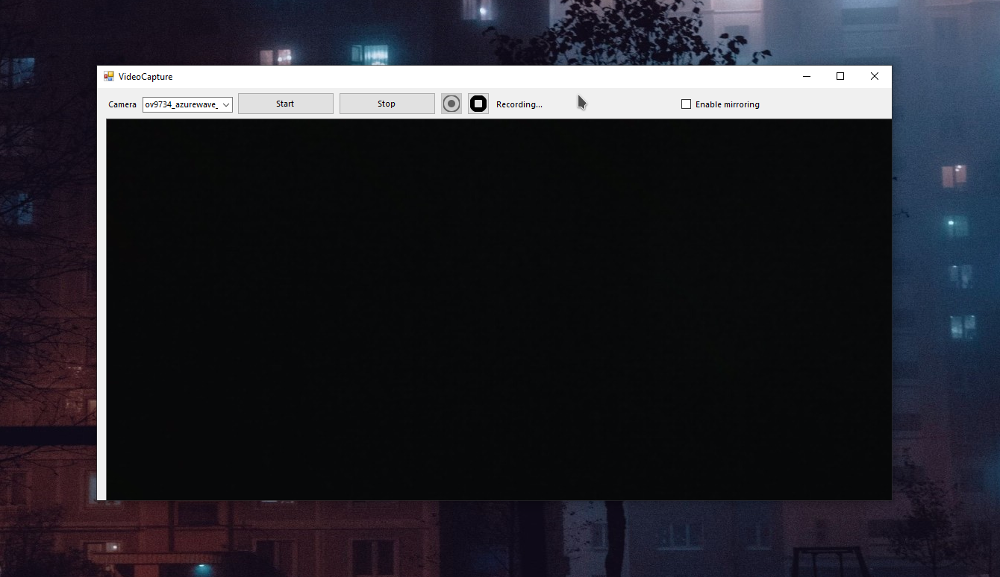

<div align="center">


# VideoCapture

Simple webcam video capture program for Windows

[Русская версия](README.ru.md)&emsp;/&emsp;[What is this?](#what-is-this) / [Features](#features) / [Compile options](#compile-options) / [License](#license)

<br>

</div>

# What is this?

VideoCapture is simple, lightweight and user-friendly video stream capture program.
It can record video from your webcam (OBS Virtual Camera is currently not supported, sorry) using different multimedia codecs.

# Features

* Simple and minimalistic user interface
* Supported video formats: AVI, MP4, MKV, etc.
* **.NET Framework *4.8* is required. Windows 7+ required**

# Compile options

VideoCapture is developed with Visual Studio 2022 and .NET Framework 4.8.\
Dependencies: ```Accord.NET, AForge, FFmpeg```

If having any troubles with VideoCapture compile, contact the program developers (see "Contributors").

# License

VideoCapture and its source codes are licensed and distributed under the terms of GNU General Public License 3.0 or newer version.
See [LICENSE](LICENSE) file for more details.

<br><br>

<div align="center">

### Code by HyperWin. Design by Ivan Movchan (NobootRecord)
### *Copyright &copy; 2023*

<br><br>




</div>
