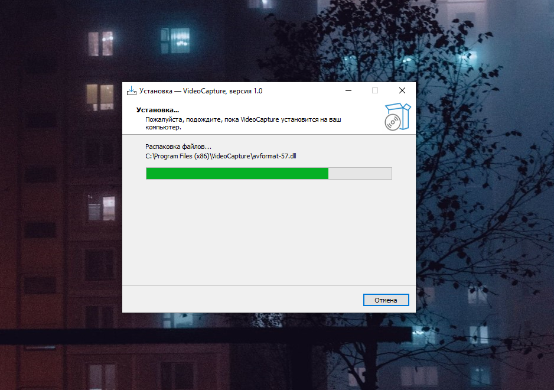
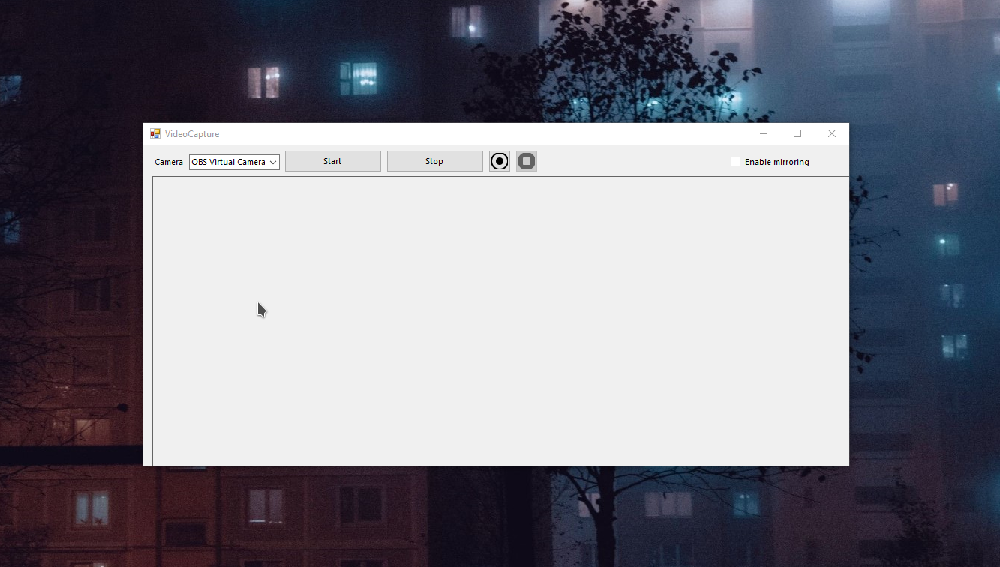
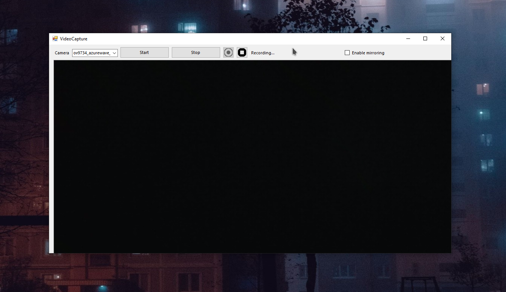

<div align="center">


# VideoCapture

Простой и быстрый камкордер для Windows

[English version](README.md)&emsp;/&emsp;[Что это?](#что-это) / [Особенности](#особенности) / [Компиляция проекта](#компиляция-проекта) / [Лицензия](#лицензия)

<br>

</div>

# Что это?

VideoCapture - это простая, легковесная и очень быстрая программа для записи видео с веб-камеры (OBS Virtual Camera пока не поддерживается).
Она поддерживает множество популярных видеоформатов с использованием интегрированных видеокодеков, а также имеет простой и удобный интерфейс.

# Особенности

* Простой и скромный, но удобный интерфейс
* Поддерживаются видеоформаты: AVI, MP4, MKV, etc.
* **Для работы требуется .NET Framework *4.8* и ОС Windows 7+**

# Компиляция проекта

VideoCapture разрабатывается с использованием Visual Studio 2022 и платформы .NET Framework 4.8.\
Используются следующие библиотеки и компоненты: ```Accord.NET, AForge, FFmpeg```

При возниковении проблем с компиляцией немедленно свяжитесь с разработчиками проекта (смотрите раздел "Contributors")

# Лицензия

Программа VideoCapture и её исходные коды лицензированы на условиях лицензии GNU General Public License 3.0 или более новой версии.
С неофициальным русским переводом лицензии можно ознакомиться [здесь](LICENSE.ru).

<br><br>

<div align="center">

### Идея, программирование: HyperWin. Графическое оформление: Иван Мовчан (NobootRecord)
### *Copyright &copy; 2023*

<br><br>






</div>
